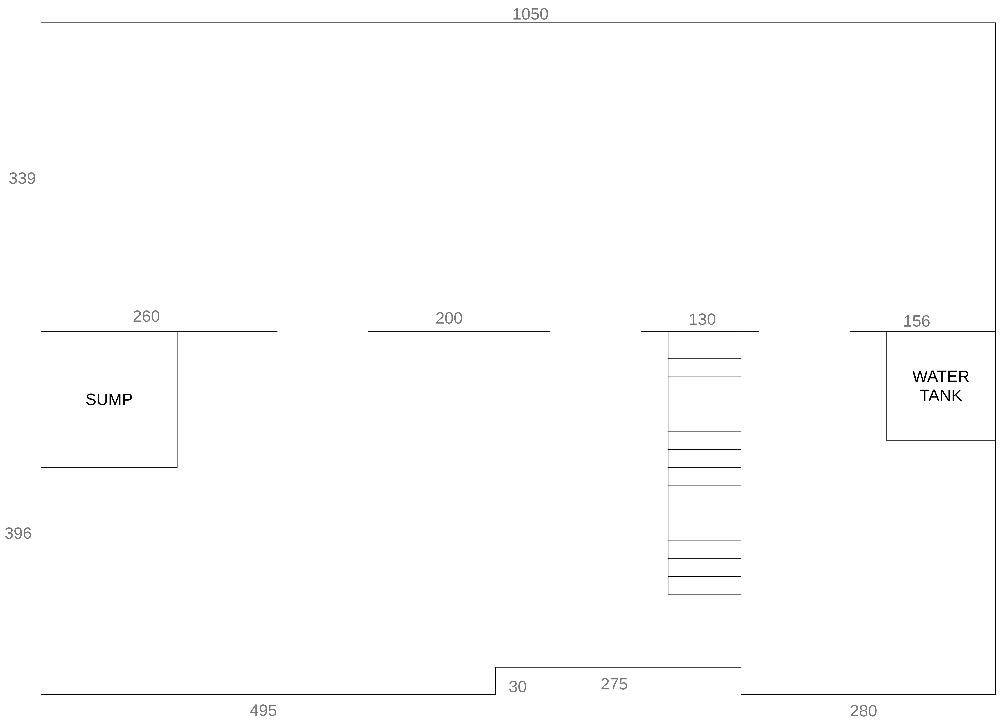
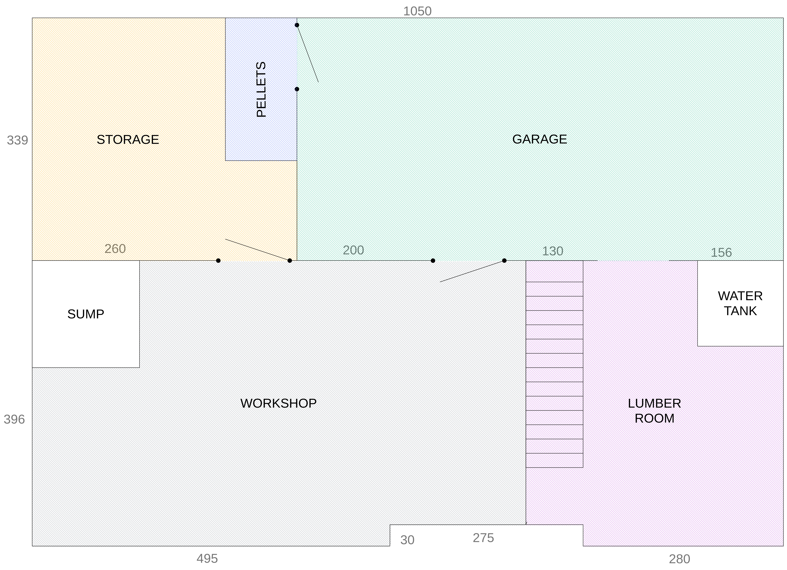

## Notes

The exposition is the following:

```
┌─ E ─┐
N     S
└─ W ─┘
```

Measurements are in centimeters.

## Initial state

As the time of writing, the basement is raw and looks like this.



Everything is open, there are no doors (aside from the garage door which is not represented here) and walls are raw.

A casing has been applied to all walls but the south one in order to prevent water leaks. This was needed because the basement is buried and we live in a very rainy area.

## Room splitting

We decided to split the basement in four main rooms and a special room to store pellets.



We argued about creating a door between the riddance and the workshop, but we chose not to because that would prevent us to change our current stairway in the future.

## Room organization

Most rooms will have wall boards installed with a thermic insulation. No decision has been taken about the floors yet.


### Storage

This room will be filled with a bunch of heavy load shelves, providing a sufficient amount of storage for mostly anything.

### Pellets

This room’s only purpose is to store pellet bags (or wood logs for future owners). Its dimensions are 100×200 centimeters. It will be able to fit more then 60 pellet bags (roughly a ton) and about one stere of wood logs.

A floor insulation and an air vent should be installed to avoid any humidity and to accelerate the wood drying process.

### Garage

This room will house our motor vehicles as well as a storage appliance (shelves or cupboard) and a maidservant.

### Workshop

This room will be dedicated to woodworking and motorcycle/car mechanic. Its organization remains to be done.

### Lumber

This room will house:
- a spare fridge and some storage for food under the stairway
- cupboards for shoes, jackets, home cleaning products and whatever does not have its place anywhere else in the basement nor the house

Also, the hot water tank, the water softener and the switchboard are already there and cannot be moved.
