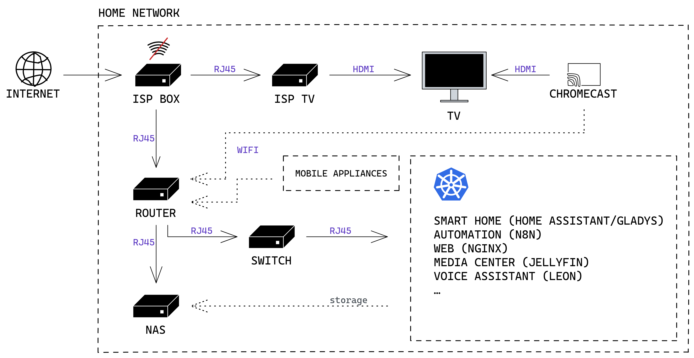

## Architecture

This diagram roughly shows the aimed architecture to implement the network.

## Equipments

### ISP

Currently, the ISP is [Orange](https://orange.fr).

This ISP provides an Internet box and a TV box.

There are some constraints with this equipment, most notably:
1. the synchronization of the TV box with the Internet box **must** be done via WPS (insecure)
2. the public IP address of the Internet box is **dynamic**
3. the routing capabilities of the Internet box are very basic

To address limitation **n°1**, the TV box will be connected to the Internet box through a wired connection (RJ45 ethernet cable).

To address limitation **n°2**, the use of a dynamic DNS provider is under consideration. List of potential providers:
- [No-IP](https://noip.com)
- [Dynu](https://dynu.com)
- [FreeDNS](https://freedns.afraid.org)

The wifi network of the Internet box will be disabled, and its firewall will be fully open.

### Router

To address **ISP equipment limitation n°3**, another router will be added behind the Internet box and will be the **only equipment connected directly to the Internet box along with the TV box**.

The router should be a custom made one, using some parts lying around. It will use [pfSense](https://pfsense.org) to define routing tables and secure the network with its firewall capabilities.

A LAN network and a WLAN network will be provided by the router:
- the LAN network will be used by the [NAS](#storage) and the Kubernetes cluster
- the WLAN network will be used by all mobile appliances ([Chromecast](#media-streaming), smartphones, printers, smart home appliances, etc…)

### Media streaming

For media content streaming, a Google [Chromecast with Google TV](https://store.google.com/us/product/chromecast_google_tv) is constantly connected to the TV through HDMI. With the extensive list of applications available in the Store, it should be sufficient to stream any media related content provided in the network.

It will be connected to the WLAN network.

### Storage

For content storage, a NAS will be connected to the LAN network. The chosen NAS is the [QNAP TS-653D-8G](https://www.qnap.com/en-us/product/ts-653d).

It will only be used to store content and share it to the network through NFS. It will not be exposed to the internet.

The disk storage is under consideration, but the following products have been identified as good candidates:
- Western Digital WD Red Pro 4 To
- Seagate IronWolf Pro 4 To

Because the chosen disks are “only” of 4To, the total available storage size will be of 8To. This capacity should be sufficient for a few years but will need to be upgraded quite quickly due to the fact that stored files will mainly be videos (movies, tv shows, anime, etc…).

_Note: the size of the current media center content is of 2To._

The disks will be configured to run in RAID1 mode, offering a very good level of reliability and a low risk of data loss.

### Applications and services

To provide applications and services, a Kubernetes cluster composed of about 10 machines of various resources capacity will be provisioned.

The cluster nodes will be connected to the LAN network through a switch. The nature of this switch has not yet been defined (hardware or software).

The Kubernetes cluster will host a yet to be known number of applications and services. The following applications have been identified:
- smart home: [Home Assistant](https://home-assistant.io) or [Gladys](https://gladysassistant.com)
- automation: [n8n](https://n8n.io)
- media center: [Jellyfin](https://jellyfin.org)
- voice assistant: [Leon](https://getleon.ai)
- web services: provisioned with [ingress-nginx](https://github.com/kubernetes/ingress-nginx)
